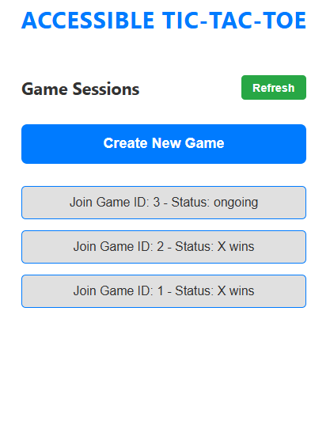
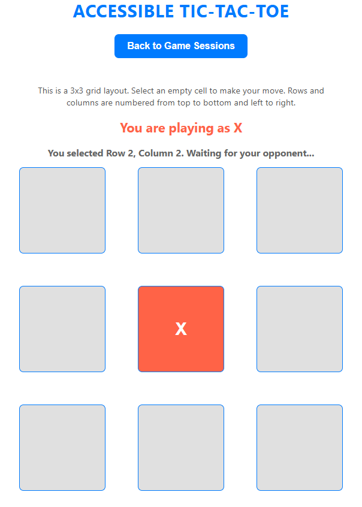

# Accessible Tic-Tac-Toe Web Application Documentation

## Types of Disabilities Considered
This web application is designed to accommodate users with the following disabilities:
1. **Cognitive** – Simplified UI with clear instructions and minimal distractions.
2. **Visual** – Aria-labels and screen-reader support for intuitive navigation, including clear live announcements.
3. **Auditory** – Text-based indicators for turn changes and results, ensuring full participation without sound reliance.
4. **Motor** – Larger click areas, adjustable spacing, and keyboard navigation.
5. **Speech** – Fully navigable without voice commands for those with speech impairments.

---

## 1. Instructions to Load and Play the Game
1. **Load the Web Application**  
   Open the application by entering the provided URL (e.g., `http://your_ip_address:3000`) in your browser. Ensure any pop-up blockers or ad blockers are disabled.

2. **Create a Game Session**  
   Click the "Create New Game" button on the homepage. The application will generate a unique game ID and add it to the list of available games.

3. **Joining from Another Browser**  
   Open the application in a new browser window or on another device connected to the same network, refresh the game list if needed, select the game session ID, and click to join. Once both players have joined, they are assigned player roles (X or O).

4. **Playing the Game**  
   Each player can take turns selecting an empty cell on the 3x3 grid. Text prompts and live announcements guide the players through their turns until a player wins or the game ends in a tie.

---

## 2. Design Decisions for Testing with Persons-with-Disabilities

I conducted accessibility testing using screen-reader simulations and keyboard-only navigation to assess usability for users with various disabilities:
- **Screen Reader Interaction**: Testing ensured that screen readers announced moves, turns, and game results with the help of aria-live regions and polite alerts.
- **Keyboard Navigation**: All interactive elements, including game cells and controls, were tested to ensure full navigation without a mouse.
- **Sensory Impairment Simulation**: Color-coded cells for X and O moves and large clickable areas were tested for motor and visual accessibility. Adjusted gap and spacing ensure touch accessibility on mobile devices.

*Example Screenshots:*
1. Session screen to create or join a game

2. The main game board with focus indicators for screen readers.

3. Visual prompts like “Your turn” and “Waiting for opponent.”


*Alternatively, video walkthroughs demonstrate accessible interaction for users with visual or motor impairments.*
https://youtu.be/fZrepYa41Fc
---

## 3. API Specifications

### List of API Endpoints
| Endpoint                | Method | Description                     |
|-------------------------|--------|---------------------------------|
| `/api/games`            | GET    | Retrieve all available games    |
| `/api/games/:id`        | GET    | Retrieve specific game details  |
| `/api/games/:id/move`   | POST   | Make a move in the game         |
| `/api/games/:id/join`   | POST   | Join a specific game session    |

### Sample API Requests
- **Retrieve All Games**  
  **GET** `/api/games`
  ```curl
  curl -X GET http://localhost:5000/api/games

- **Retrieve Specific Game**  
  **GET** `/api/games/1`
  ```curl
  curl -X GET http://localhost:5000/api/games/1

- **Join Game Session**  
  **POST** `/api/games/1/join`
  ```curl
  curl -X POST http://localhost:5000/api/games/1/join -d '{"playerId": "player1"}' -H "Content-Type: application/json"

- **Make a Move**  
  **POST** `/api/games/1/move`
  ```curl
  curl -X POST http://localhost:5000/api/games/1/move -d '{"playerId": "player1", "row": 0, "col": 1}' -H "Content-Type: application/json"


## 4. Summary of Design and Accessibility Considerations

This Tic-Tac-Toe web application prioritizes accessibility through comprehensive design choices tailored to users with sensory, cognitive, and motor disabilities. To enhance inclusivity:

- **Aria Roles and Live Regions**: The application uses Aria roles and live regions to provide real-time game updates. Moves made by the opponent are automatically announced via screen readers, allowing users with visual impairments to stay informed on game progress without needing to look at the screen.

- **Keyboard Navigation**: Every interactive element, including instructions, is accessible by tab navigation, enabling users to explore game elements in a structured order. Key game instructions, board cells, and options are all navigable by keyboard alone, and each cell is described by row and column location, allowing easy navigation and spatial understanding.

- **Polling vs. WebSockets**: Polling was chosen over WebSockets due to its simplicity and compatibility across various devices and network conditions. Polling intervals update the game state frequently enough to keep both players’ views synchronized while minimizing server load. This design choice balances accessibility and technical efficiency.

- **Audio Feedback**: When the opponent makes a move, an audio cue and screen reader announcement inform the user, enhancing accessibility for visually impaired players. This immediate feedback creates an engaging experience without requiring the player’s visual attention.

- **UI Simplicity and Contrast**: The interface uses clear, high-contrast colors and large, easily distinguishable buttons, with visual and auditory feedback for each game action. This benefits users with low vision, cognitive disabilities, and motor impairments.

- **Responsive Design**: CSS media queries and flexible layouts adapt the interface to mobile and desktop devices, maintaining a seamless and accessible experience across various screen sizes and orientations.

This application’s infrastructure, featuring RESTful APIs for smooth frontend-backend communication, allows for consistent performance across devices. These design and accessibility considerations combine to make this Tic-Tac-Toe game an inclusive, user-friendly experience suitable for diverse users.

## 5. Architecture Diagram

                 +------------------------+
                 |      Client (Browser)  |
                 |    (React Frontend)    |
                 +-----------+------------+
                             ^
                             |
                             v
                 +------------------------+
                 |       Express API      |
                 |       (Backend)        |
                 +-----------+------------+
                             ^
                             |
                             v
                 +------------------------+
                 |      MySQL Database    |
                 |    (Game Storage)      |
                 +------------------------+

- Client (Browser): Hosts the React frontend, connecting users with the game board and API endpoints.

- Express API (Backend): Manages game state, player actions, and provides game data through RESTful APIs.

- MySQL Database: Stores game sessions, player moves, and related data, ensuring game continuity and multi-session support.